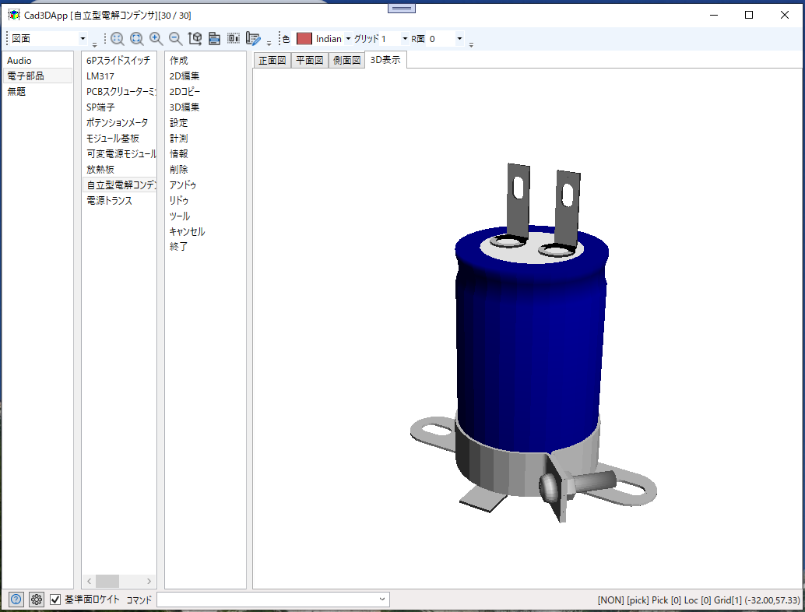

# Cad3DApp
## 三面図からつくる三次元ＣＡＤ

平面図や側面図で作成した図形から3D図形を作成する三次元CAD  
Mini3DCadのソースを見直して再作成したもので機能的にはMini3DCadとほとんど同じ

### 履歴
2025/07/09 実験的にスクリプト機能を追加  
2025/06/01 キーコマンドを追加  
2025/05/05 2D非表示機能追加  
2025/04/24 GitHubに登録  
2025/04/18 リドゥを追加(CommandOpe.undo(),redo(),EditEntity.addEntity())  
2025/04/08 ワイヤーフレーム表示追加(2DVertexListから変換)  
2025/03/?? ブレンド機能追加(複数要素対応)  
2025/02/?? 押出で複数要素から中抜きを一括一括作成(水平スキャン方式)  
2025/01/?? Mini3DCadから移植し直し(Primitive → Entity)  

### ■実行環境
[Cad3DApp.zip](Cad3DApp.zip)をダウンロードして適当なフォルダに展開し、フォルダ内の Mini3DCad.exe をダブルクリックして実行します。  
動作環境によって「.NET 8.0 Runtime」が必要になる場合もあります。  
https://dotnet.microsoft.com/ja-jp/download

### ■開発環境  
開発ソフト : Microsoft Visual Studio 2022  
開発言語　 : C# 10.0 Windows アプリケーション  
フレームワーク　 :  .NET 8.0  
NuGetライブラリ : なし  
自作ライブラリ  : CoreLib (三次元の幾何計算も含む)  
